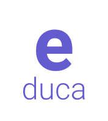
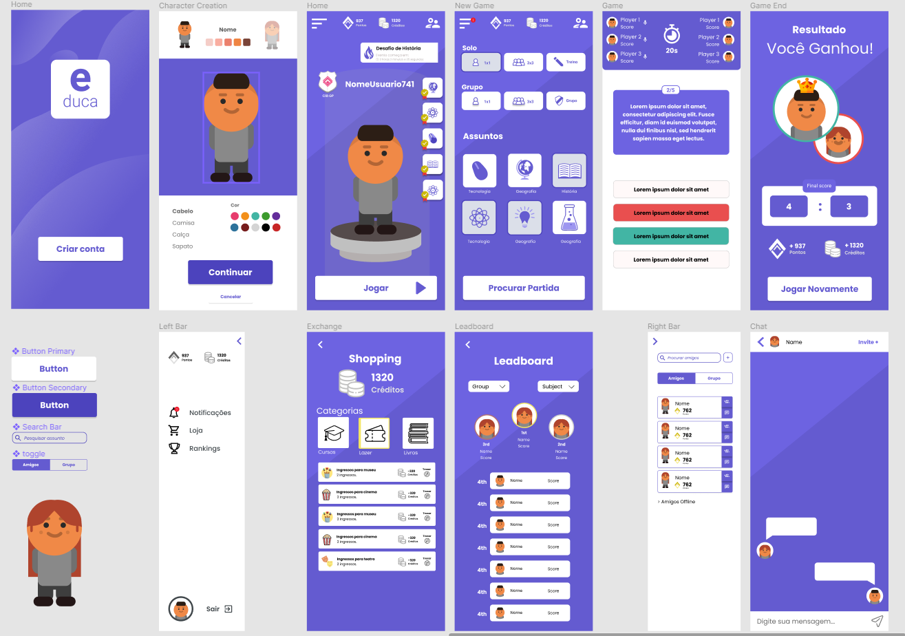

<!-- PROJECT LOGO -->
 

  

  <!-- <h1 align="center">e-duca</h1> -->

  

    Projeto desenvolvido para o Hackathon CCR realizado pela Shawee. A ideia consiste em desenvolver um jogo em formato de quiz para auxiliar jovens alunos em seu processo de aprendizagem e adaptar trilhas de conteúdo específicas para seus problemas pessoais. É uma plataforma competitiva com recompensas reais que promove engajamento em atividades escolares coletivas.
     
    <a href="https://e-duca.netlify.app/">Ver Demo</a>
  

  
<h2 style="display: inline-block">Tabela de Conteúdo</h2>

  <ol>
    <li>
      <a href="#sobre-o-projeto">Sobre o Projeto</a>
      <ul>
        <li><a href="#utilizamos">Utilizamos</a></li>
      </ul>
    </li>
    <li><a href="#uso">Uso</a></li>
    <li><a href="#contato">Contato</a></li>
  </ol>

## Sobre o Projeto
Abaixo temos a prototipação do projeto feita no Figma, plataforma para design colaborativo.

### Utilizamos

* [Nuxt](https://github.com/nuxt)
* [Nuxt PWA](https://github.com/nuxt-community/pwa-module)
* [Nuxt LocalStorage](https://github.com/rubystarashe/nuxt-vuex-localstorage)
* [Nuxt SVG Loader](https://github.com/nuxt-community/svg-module)
* [Sass Loader](https://github.com/webpack-contrib/sass-loader)
* [Typescript](https://github.com/microsoft/TypeScript)
* [Vue](https://github.com/vuejs/vue)
* [Vue Lottie](https://github.com/chenqingspring/vue-lottie)
* [Vue Modal](https://github.com/euvl/vue-js-modal)

## Contato

- Bruno Mengaldo - [@brunomengaldo](https://twitter.com/brunomengaldo)
- Guilherme Oliveira - [@Guiqft](https://twitter.com/Guiqft)
- Henrique Cunha - [@henrycunh](https://twitter.com/henrycunh)
- Jonathan Silva - [@jj_neno](https://twitter.com/jj_neno)
- Rodrigo Godinho - [@rodlego_](https://twitter.com/rodlego_)
